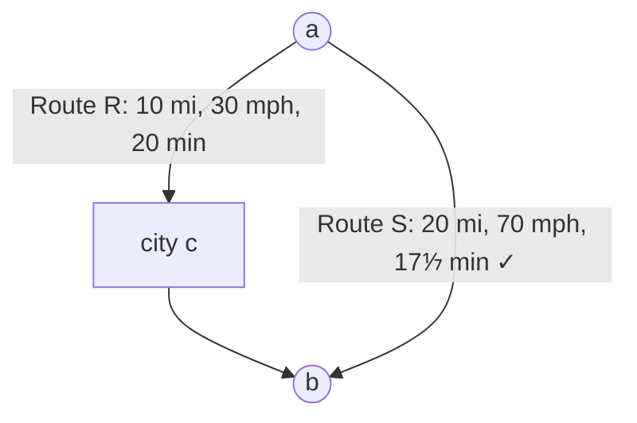

# Exercise 1.3

> *[5]* Design/draw a road network with two points $a$ and $b$ such that the fastest route between $a$ and $b$ is not the shortest route.

Imagine that $a$ and $b$ have two roads between them.
- One road $R$ is a direct route through a city $c$ that is 10 miles long in total, but speed restricted to 30mph.
- The other road $S$ is a bypass motorway between $a$ and $b$ that is 20 miles long but allows speeds up to 70mph.

It will take at least 20 minutes to traverse the longer road $R$, but $17\frac{1}{7}$ minutes to traverse the bypass road $S$.

