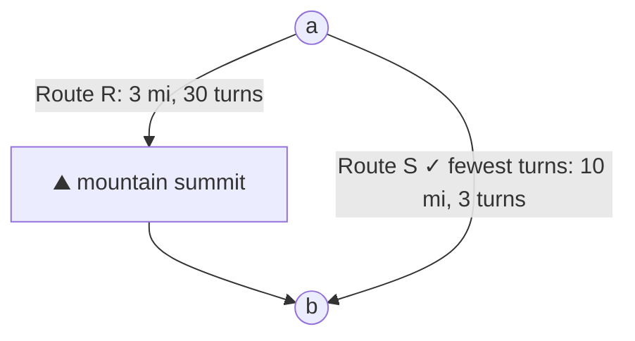

# Exercise 1.4

> *[5]* Design/draw a road network with two points $a$ and $b$ such that the shortest route between $a$ and $b$ is not the route with the fewest turns

Imagine there is a mountain between $a$ and $b$. The shorter more direct route $R$ between $a$ and $b$ goes directly across the mountain, up to the top and back down again. This is a practical reason why a road would have many twists and turns. In this example it is 3 miles long and has 30 turns.

The longer route $S$ goes around the mountain, it is 10 miles long and has 3 turns, in a large U-shape.

