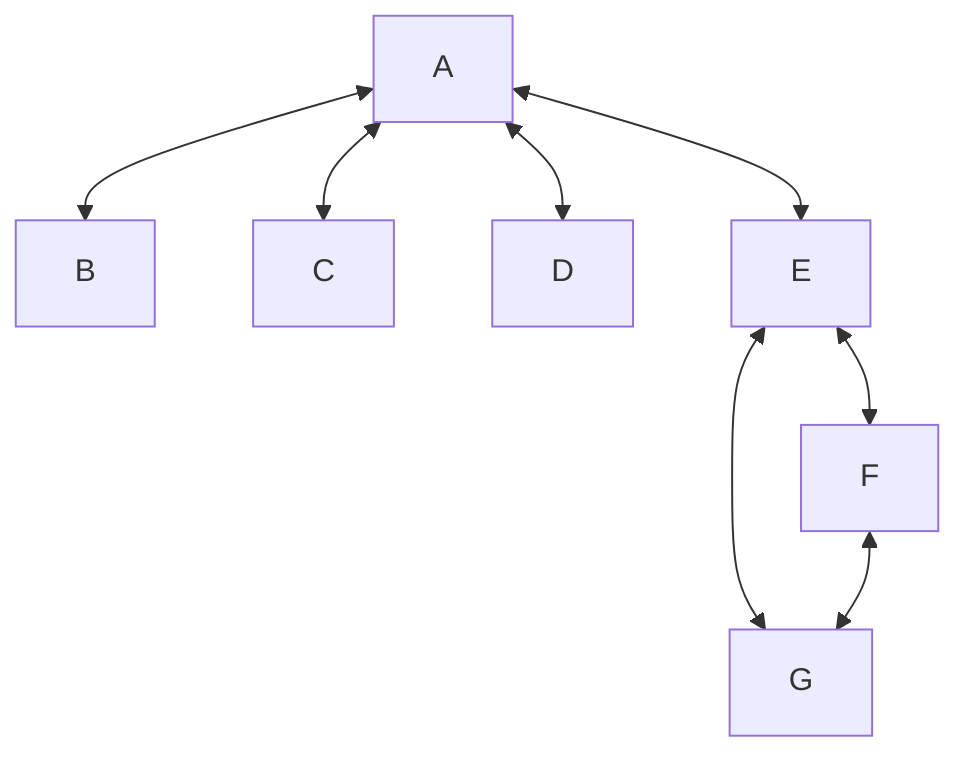

# Exercise 1.7

In this counterexample, the algorithm will be pick vertex A first (degree of 4). Since there are no vertices in the clique yet, the highest degree vertex is always added to the clique first.

Then the algorithm will add E next (degree of 3). No more vertices are neighbours of both A and E, so it finds A and E as the maximum clique.

However, the maximum clique is E, F and G, as they are all neighbours of each other.

